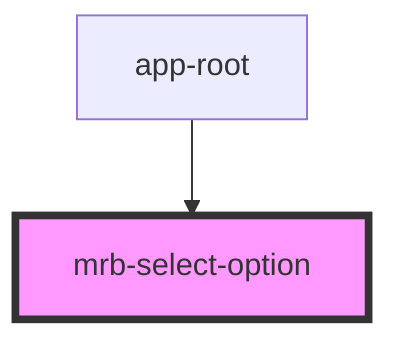

# mrb-select-option

<!-- Auto Generated Below -->

## Properties

| Property | Attribute | Description | Type               | Default     |
| -------- | --------- | ----------- | ------------------ | ----------- |
| `role`   | `role`    |             | `string`           | `'option'`  |
| `value`  | `value`   |             | `number \| string` | `undefined` |

## Events

| Event         | Description | Type                            |
| ------------- | ----------- | ------------------------------- |
| `clickOption` |             | `CustomEvent<number \| string>` |

## Dependencies

### Used by

 - [app-root](../../..)

### Graph

----------------------------------------------

*Built with [StencilJS](https://stenciljs.com/)*
