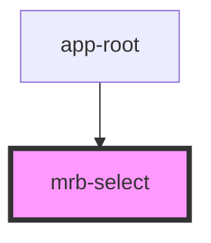

# mrb-select

<!-- Auto Generated Below -->

## Properties

| Property  | Attribute | Description | Type    | Default     |
| --------- | --------- | ----------- | ------- | ----------- |
| `options` | --        |             | `any[]` | `undefined` |

## Dependencies

### Used by

- [app-root](../..)

### Graph

---

_Built with [StencilJS](https://stenciljs.com/)_
