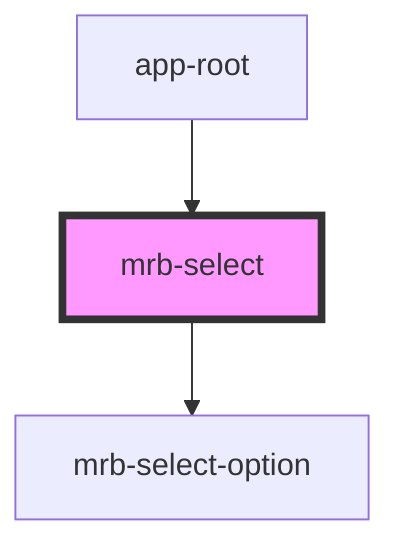

# mrb-select

<!-- Auto Generated Below -->

## Properties

| Property             | Attribute | Description | Type     | Default      |
| -------------------- | --------- | ----------- | -------- | ------------ |
| `idOption`           | `id`      |             | `string` | `'combobox'` |
| `label` _(required)_ | `label`   |             | `string` | `undefined`  |
| `options`            | --        |             | `any[]`  | `undefined`  |

## Events

| Event                    | Description | Type                   |
| ------------------------ | ----------- | ---------------------- |
| `changeVisibilityOption` |             | `CustomEvent<boolean>` |

## Dependencies

### Used by

 - [app-root](../..)

### Depends on

- [mrb-select-option](option)

### Graph

----------------------------------------------

*Built with [StencilJS](https://stenciljs.com/)*
